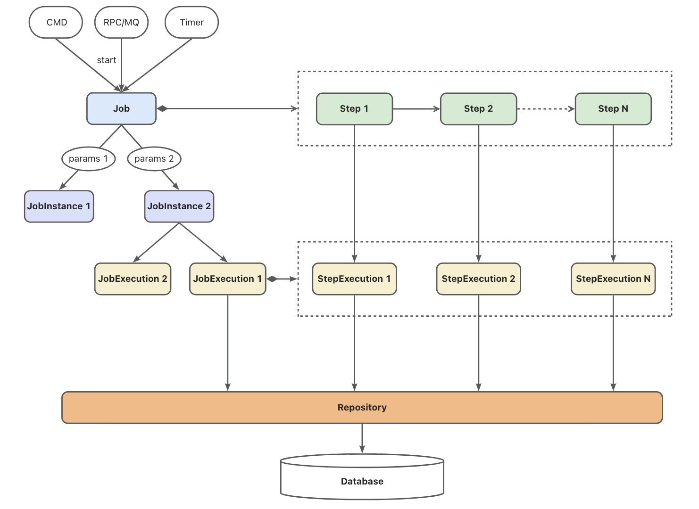

# Job Introduction

A Job is a parameterized, reusable batch processing unit. A job consists of multiple Steps that are executed sequentially during job execution.

## Structure

The static structure of a job is as follows:


Jobs can be triggered in various ways, such as command line, RPC requests, MQ messages, or timers. Jobs can accept parameters during execution (typical parameters like date), with different parameters corresponding to different job instances. A job instance may be executed multiple times, with each execution generating an execution record containing the job's start time, end time, running status, or results. Similarly, each step within the job generates a step execution record for each execution, which is associated with the job execution record.
Job instances and execution records of both jobs and steps are persisted in the database.


## Parameters

Jobs can accept different parameters and execute corresponding business logic at runtime based on the input parameters. A typical example of job parameters is date. For instance, in financial accounting processing, end-of-day batch processing tasks execute accounting operations for the corresponding date based on different date parameters.

Job parameters are shared among all steps within the job, meaning each step can access the job parameters and execute corresponding business logic based on these parameters.

When starting a job in gobatch, parameters must be provided in JSON string format.

## States

The execution records of jobs and steps maintain their running states or results, explained as follows:

- **STARTING**: Indicates the job or step is starting
- **STARTED**: Indicates the job or step has started and is running
- **STOPPING**: Indicates the job or step has received a stop command
- **STOPPED**: Indicates the job or step has stopped running
- **COMPLETED**: Indicates the job or step has successfully completed
- **FAILED**: Indicates the job or step execution failed
- **UNKNOWN**: Indicates the job or step status is unknown

## Listners

```go
// JobListener defines callbacks for job lifecycle events
type JobListener interface {
	// BeforeJob is called before a job execution starts
	BeforeJob(execution *JobExecution) BatchError
	// AfterJob is called after a job execution completes, regardless of success or failure
	AfterJob(execution *JobExecution) BatchError
}
```

## Operations

### Starting a Job

There are two job start modes:
- Synchronous execution: Starts the job and blocks until the job completes or fails
- Asynchronous execution: Starts the job and returns immediately, with the job executing asynchronously in a separate goroutine

```go
// Synchronous job start
// params is a JSON string
gobatch.Start(ctx context.Context, jobName string, params string)

// Asynchronous job start
// params is a JSON string
gobatch.StartAsync(ctx context.Context, jobName string, params string)
```

### Stop Job

```go
// Stop a running job
// jobId can be one of two types:
// 1. jobName - Finds the last execution record of the most recent job instance by jobName, stops if status is STARTING or STARTED
// 2. jobExecutionId - Finds and stops the job execution record by jobExecutionId, no error if already stopped
gobatch.Stop(ctx context.Context, jobId interface{}) error
```

### Restart Job

```go
// Restart a stopped or failed job
// jobId can be one of two types:
// 1. jobName - Finds the last execution record of the most recent job instance by jobName, restarts if status is STOPPED or FAILED
// 2. jobExecutionId - Finds the job instance by jobExecutionId and its last execution record, restarts if status is STOPPED or FAILED
gobatch.Restart(ctx context.Context, jobId interface{}) error
```

For information on how to write Jobs, please refer to [Example 1](usage_examples.md) and [Example 2](file_examples.md).