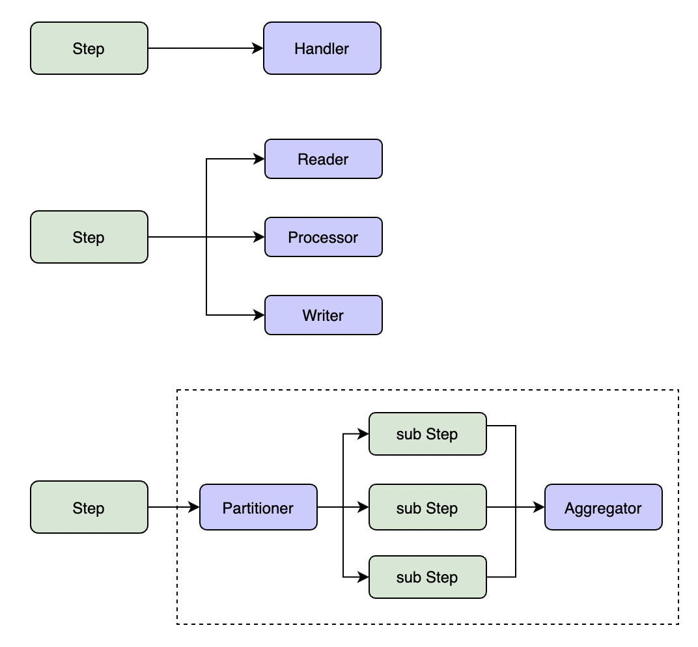
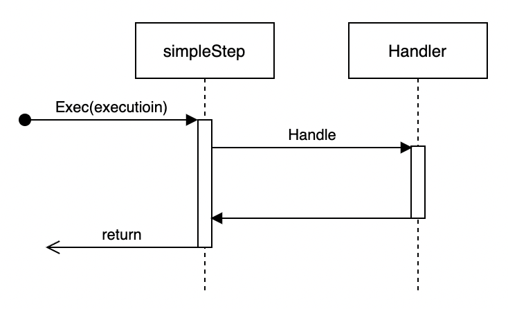
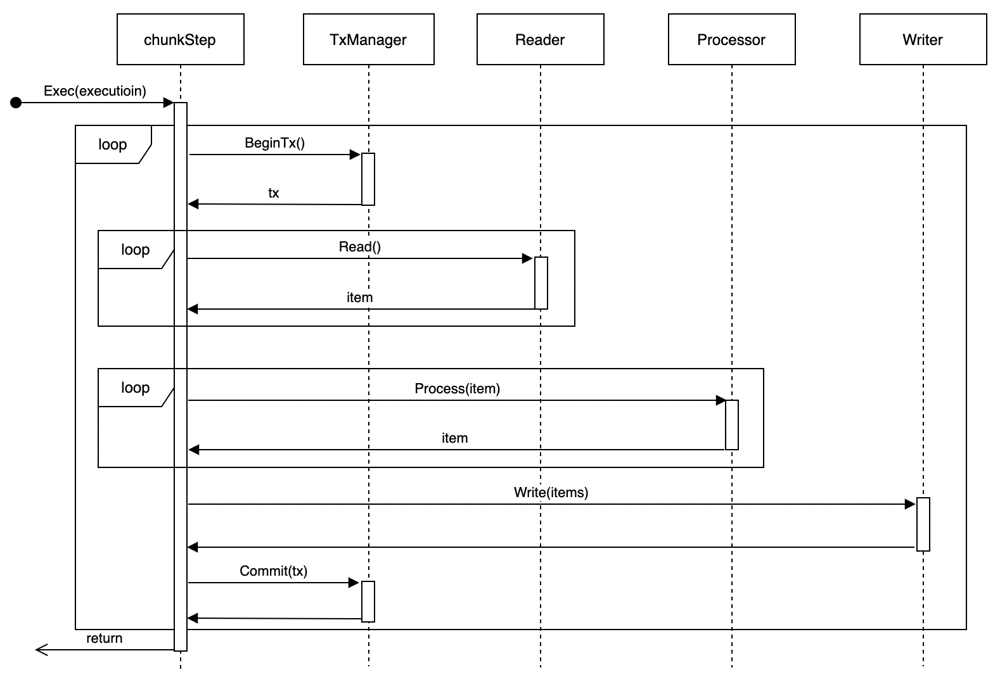

# Step Introduction

## Step Types

GoBatch supports three types of steps:

1. **SimpleStep**
   - Executes a task in a single thread
   - Suitable for simple processing logic
   - Implements business logic through Handler or Task interface

2. **ChunkStep**
   - Processes data in chunks
   - Implements "read-process-write" pattern
   - Supports transaction management
   - Main components:
     - ItemReader: Data reading
     - ItemProcessor: Data processing
     - ItemWriter: Data writing

3. **PartitionStep**
   - Supports parallel processing
   - Splits large tasks into subtasks
   - Can aggregate subtask results
   - Main components:
     - Partitioner: Task partitioning
     - Aggregator: Result aggregation



## Writing Simple Step

Simple step executes business logic in a single thread. Suitable for simple processing scenarios that don't require data partitioning.

Implementation:
```go
// Method 1: Implement Handler interface
type Handler interface {
    Handle(execution *StepExecution) BatchError
}

// Method 2: Write function with supported signatures
func(execution *StepExecution) BatchError
func(execution *StepExecution)
func() error
func()

// Build step
step := gobatch.NewStep("step1").Handler(myHandler).Build()
// or
step := gobatch.NewStep("step1", myHandler).Build()
```

## Writing Chunk Step

Chunk step processes data in chunks using read-process-write pattern. Suitable for large-scale data processing.

Core components:
- Reader: Read data
- Processor: Process data (optional)
- Writer: Write data

Implementation:
```go
// Reader interface
type Reader interface {
    Read(chunkCtx *ChunkContext) (interface{}, BatchError)
}

// Processor interface
type Processor interface {
    Process(item interface{}, chunkCtx *ChunkContext) (interface{}, BatchError)
}

// Writer interface
type Writer interface {
    Write(items []interface{}, chunkCtx *ChunkContext) BatchError
}

// Build step
step := gobatch.NewStep("chunk_step").
    Reader(&myReader{}).
    Processor(&myProcessor{}).
    Writer(&myWriter{}).
    ChunkSize(10).
    Build()
```

## Writing Partition Step

Partition step splits task into multiple subtasks for parallel execution and aggregates results. Suitable for large-scale data processing that can be parallelized.

Core components:
- Partitioner: Task partitioning
- Aggregator: Result aggregation (optional)

Implementation:
```go
// Partitioner interface
type Partitioner interface {
    Partition(execution *StepExecution, partitions uint) ([]*StepExecution, BatchError)
    GetPartitionNames(execution *StepExecution, partitions uint) []string
}

// Aggregator interface
type Aggregator interface {
    Aggregate(execution *StepExecution, subExecutions []*StepExecution) BatchError
}

// Build step
step := gobatch.NewStep("partition_step").
    Handler(handler).
    Partitioner(partitioner).
    Aggregator(aggregator).
    Partitions(10).
    Build()
```

## Lifecycle Listeners

Various phases of step execution can be intercepted using listeners:

```go
// Step listener
type StepListener interface {
    BeforeStep(execution *StepExecution) BatchError
    AfterStep(execution *StepExecution) BatchError
}

// Chunk listener
type ChunkListener interface {
    BeforeChunk(context *ChunkContext) BatchError
    AfterChunk(context *ChunkContext) BatchError
    OnError(context *ChunkContext, err BatchError)
}

// Partition listener
type PartitionListener interface {
    BeforePartition(execution *StepExecution) BatchError
    AfterPartition(execution *StepExecution, subExecutions []*StepExecution) BatchError
    OnError(execution *StepExecution, err BatchError)
}
```

## File Processing

GoBatch provides built-in file processing components that support:
- Multiple file formats (CSV, TSV, etc.)
- File encoding settings
- Automatic field mapping
- File validation

Example:
```go
// Define file model
var fileModel = file.FileObjectModel{
    FileStore:     &file.LocalFileSystem{},
    FileName:      "data/{date}/file.csv",
    Type:          file.CSV,
    Encoding:      "utf-8",
    Header:        true,
    ItemPrototype: &MyData{},
}

// Read file
step := gobatch.NewStep("file_read").
    ReadFile(fileModel).
    Writer(&myWriter{}).
    Build()

// Write file
step := gobatch.NewStep("file_write").
    Reader(&myReader{}).
    WriteFile(fileModel).
    Build()
```

## Execution Flow

### Simple Step Execution
Simple step executes Handler's business logic directly in the current Job thread. Suitable for simple business logic scenarios.



### Chunk Step Execution
Executes the following flow in a single thread:
1. Start transaction
2. Read specified size of data chunk
3. Process data
4. Write results
5. Commit or rollback transaction
6. Repeat above steps until processing completes



### Partition Step Execution
1. Use Partitioner to partition data
2. Generate substeps for each partition
3. Execute substeps in parallel
4. Wait for all substeps to complete
5. Use Aggregator to aggregate results


For information on how to write Steps, please refer to [Example 1](usage_examples.md) and [Example 2](file_examples.md).